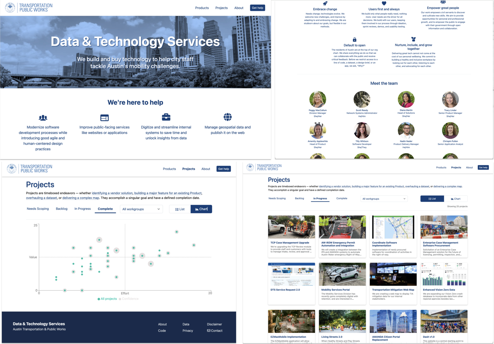

# atd-product

A website about ATD's Data & Technology Services team.

## Website

[https://austinmobility.io](https://austinmobility.io)


## Development

### Architecture


### Get it running

Local development requires `git` and `npm`.

Clone this repo

```
$ git clone git@github.com:cityofaustin/atd-product.git
```

Install packages

```
$ npm install
```

Start the local development server

⚠️ Running the Next development server is fine for most use cases, but does not test the static site export. See [Static export server](#static-export-server).

```
$ npm run dev
```

### Static export server

As discussed [here](https://github.com/cityofaustin/atd-product/pull/109#discussion_r2364368332), the app's static export should be tested prior to deployment. To do so:

1. Build the nextjs app, which will save the output in the `./out` directory: `npm run build`
2. Run `npx serve@latest out -s` to serve the `./out` directory on `localhost`.
3. Run `npm run build` whenever changes are made


### Icon attributions

- [Change](https://thenounproject.com/search/?q=alternate&i=3026571)
- [Grow](https://thenounproject.com/term/grow/204852/)
- [Unlock](https://thenounproject.com/term/unlock/10608/)
- [Empower](https://thenounproject.com/term/astronaut/2527039/)
- [Heart](https://thenounproject.com/term/heart-user/327074/)
